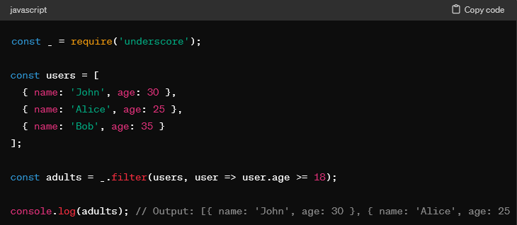

### What Software Enginnering Means to Me

This software engineering course has been a pleasant surprise for me. Coming in with a keen interest but unsure of what to expect, I've been positively surprised by the different specs of the material covered. While my initial interest was sparked by a fascination with software engineering, I wasn't entirely sure how it would translate into a classroom setting. However, the practical knowledge gained in this course has given me a clearer understanding of real-world software development. From breaking down tasks to designing reusable solutions, the skills learned here are directly applicable to future projects.

Throughout this software engineering course, I've discovered that it's not just about building web applications; it's about mastering fundamental concepts that apply to any project. Two key takeaways for me are User Interface (UI) Frameworks and Design Patterns.

### User Interface (UI) Frameworks

UI frameworks are like toolkits that make it easier for developers to create user interfaces for all sorts of projects, like websites, desktop programs, and mobile apps. These frameworks provide a set of rules and tools that help developers design interfaces that are easy to use and look good. So, whether you're making a website or a mobile app, UI frameworks give you everything you need to make it work and look nice.

For example, the group project I did for this class was a studylink application aimed to provide a platform for students to connect, collaborate, and support each other in their academic pursuits. Understanding the importance of a user-friendly interface for fostering engagement, I turned to UI frameworks to streamline the design process and enhance the overall user experience. One of the pivotal features was the creation of study sessions and a shared calendar function accessible to all users. Moreover, integrating a shared calendar function into the application required careful consideration of usability and accessibility. Here, the UI framework's support for interactive components and data visualization proved invaluable. By incorporating a calendar component with features like event scheduling, the application's calendar function became a central hub for coordinating study sessions and managing academic schedules collaboratively.

  4. Essays: I did not use AI initially for essays but towards the end of the semester, I found using AI for ideas really helped me start the initial train of flow for my essays. For example, in the design pattern essay, after reading up about different design patterns, I was still conceptually confused on the different patterns. At that point, I had asked ChatGPT to explain in more details: "Can you give me examples of the 3 different type of design patterns?". With actual coded examples, I was able to understand at what given moments I had used design patterns in my current and past codes.

  5. Final project: I did use AI on multiple occasions for the final project. In the beginning of the project, just setting up each page was relatively easy as it was similar to previous materials we have learned so I didn't use AI during those times. But when it came to incorporating new material we have not learned how to use, I would occasionally ask ChatGPT whenever I got stuck and couldn't dig myself out of the hole. For example, in our final group project we had to make a study application that helps connect students with joining study sessions for ICS/IT students in UHM. In our application, we had to develop a calendar, which we have not learned how to do in class yet. After finding a fullcalendar plug-in we could use for meteor, I found the instructions on how to use fullcalendar a bit vague in terms of what we wanted to use it for. Setting up the initial calendar was simple but having to add events with a working collections ended up being pretty difficult. With my groupmates, after going through trial and error for each solution we came up with, even with ChatGPT's help, we were finally able to incorporate some of ChatGPT's as well as our own solutions. ChatGPT helps in giving a base case/framework but we need to know how to mold it. In this case, I think it showcases how important it is to also understand the material as not all of ChatGPT's answers fit your problem even if it does help in others.

  6. Learning a concept / tutorial: I did use AI to help understand a concept on multiple occasions. Although, there are many articles available online that cover material I have yet to learn, a lot of times, I find it difficult to understand what exactly it is trying to tell me. Especially if I am learning it for the first time, when the word choices and examples are convoluted, I would need a simpler explanation. I found that if I copy the difficult example/phrase and use ChatGPT to explain what exactly it means, or to explain in simpler terms, most of the times I would actually understand it better. For example, when we first started learning how to use the underscore function in javascript, there were a lot of new functions to learn and I felt overwhelmed at first. Even each function only had one example, I used ChatGPT to understand in more detail what each function was used for: "Could you give me multiple examples on how to use the underscore function filter in javascript?". This really helped me understand how to use filter on different problems and for different variables to the point, I found myself using it to solve a lot of problems in WODs compared to other functions I could've used.

  7. Answering a question in class or in Discord: I did not use AI to answer any questions in class or on discord. In terms of answering questions in class, usually it would be in a group settings, when we are doing practice in-class WODs and have questions for one another. I found that in these times, trying to solve the problems on your own was more efficient so that I don't rely on AI for all thought processes and it was more beneficial as a group to go through each problem together and seeing when the lightbulb goes on when we worked through the problem.

  8. Asking or answering a smart-question: I did not use AI to ask or answer a smart-question. To be fair, I did not ask or answer any smart questions on Discord but I have asked a fair share of questions to the TA and professor in class. I don't really like using AI to help ask for questions as it would either change my question into something I'm not really asking for and would lose the personal touch of what my problem actually is. Plus as a student learning how to ask a smart question, I found it more productive to think about how to format the question myself.

  9. Coding example e.g. “give an example of using Underscore .pluck”: Similar to learning a concept, I ended up actually using coding examples the most for underscore in javascript. As the beginning of class was more programming heavy in terms of a typical coding language. As a first time underscore function user, I used ChatGPT to ask for a lot of coding examples of each function. I'm usually a multiple-example learner as I usually try to see the related pattern between each example and try to understand why it works that way.

  10. Explaining code: I definitely used AI to explain codes that I did not understand or why my code was not outputting exactly what I needed it to. A lot of times when using IntelliJ, my code would pass the ESLint check and I would think everything works but when I check my browser, my website/application would not display what I wanted it to. Confused on what exactly went wrong, I would end up copying my code into ChatGPT to ask why my code is not outputting what I want it to. For example, "Why is my code not displaying the font I added?". Then it gave me a thorough explanation on what could possibly be the problem and how to change it so that it may work.

  11. Writing code: I used AI to write code, usually to help fix a current code I had already made or to start a code I wasn't sure of. I usually had a harder time with AI when it came to fixing a current code already made as the solutions would usually also not work but after learning to use AI more proficiently in this class. I found that even though some solutions AI gives doesn't work, a lot of times if you can edit and change certain aspects to fit your problem then it'll usually end up working. In terms of efficiency, this really helped me speed up my code as I don't have to sit there for multiple hours wondering what went wrong but instead use that time with the help of AI to come up and try multiple different solutions.

  12. Documenting code: I did not use AI to document my codes. I think it is important to know what exactly your code does even if it is a code from AI so when documenting the code, we should write what the code block does ourselves.

  13. Quality assurance: I did use AI for quality assurance, especially when it came to essays. I tend to have a lot of spelling and grammatical mistakes. I ended up using Grammarly on almost all my essays after I finished just for that last cherry on the top.

  14. Other uses in ICS 314 not listed above: I think the ones listed above were all the times I have and have not used AI in ICS 314.

### III. Impact on Learning and Understanding:

Using AI has definitely influenced my learning experience in terms of comprehension and efficiency. I found myself over the years depending on AI more for each class. Whenever I find myself stuck in a situation of confusion, I end up asking AI for help in understanding or fixing my problem. What I have learned is that AI is not always right, of course formatting the question correctly is also important but a lot of the times you need to actually understand the the material as well. If you just end up asking AI blindly on giving you an answer, you will have come out of that experience learning absolutely nothing as well as not even knowing if that answer is correct. AI has definitely enhanced my learning in software engineering concepts as if you are a programmer, there will be multiple times you get stuck and have to dig yourself out of the hole. I used to not use AI when I first started coding and I found myself just staring at my code for hours on end, which it would end up being a simple one letter bug that AI would've found for me in seconds. I think it's important to work alongside AI to help increase efficiency but know how to do the work as well.

### IV. Practical Applications:

AI definitely has practical applications you can use in the real-world outside of school. AI applications have proven effective in addressing real-world problems across various domains by data-driven insights, automation, and predictive analytics. For example, in terms of environmental conservations, AI is used to effectively monitor ecosystems, track wildlife populations, and detect environmental changes. AI can and is being used in multiple fields, such as in finance. AI is employed for fraud detection, risk assessment, customer service automation, and much more. There are many ways AI applications address real-world software engineering challenges. For example, AI technologies support collaborative software development practices by facilitating knowledge sharing, code reuse, code maintenance, and automation.These examples illustrate the diverse applications of AI across various industries and domains. AI will continue to evolve and grow across different fields and sections. 

### V. Challenges and Opportunities:

Although AI potential is possibly limitless, it comes with its limitations and challenges. Specifically throughout ICS 314, I experienced the challenges of using AI to help debug my code or finding a solution to my problems. A lot of times, AI will give you basic framework but won't exactly execute what you need specifically. For example, when I attempted to create spacing in between my columns for one of the experience WODs. ChatGPT suggested making my columns bigger instead. Potential opportunities for integrating AI specifically in the software engineering education side would be offering dedicated AI courses/tracks, collaborative research projects, and guest lectures and workshops.

### VI. Comparative Analysis:

Traditional teaching methods and AI-enhanced approaches in the context of software engineering education both have their pros and cons. Traditional teaching usually offers a more engaging experience which relies on in-person lectures, readings, and assignments. Although at times, if it's too lecture based it would not be as engaging but more passive learning as students may not be paying attention. While AI- enhanced approaches may not be engaging in terms of being personal with someone teaching you in-person but it might be more engaging through interactive learning. As it requires students to be more involved in how they use the AI to further improve their skills and knowledge. In terms of practical skill and knowledge retention, traditional teaching methods tend to be more conceptual based, which often limit hands-on practice and affects knowledge retention. While AI-enhanced approaches may facilitate skill and knowledge retention just by being hands-on.

### VII. Future Considerations:

The future of AI in software engineering education will always be evolving, as software engineering focuses on advancing technological items/concepts. AI can help in productivity, efficiency, and skill development which would help future students of the field. Although there would be several challenges as well since you wouldn't want students to become to dependent on AI to do all their work for them without actually understanding the work. Areas for improvement would definitely be collaborative but also ethical in terms of enhancing learning experience and fostering innovation without taking away the future potential of students.

### VIII. Conclusion:

In conclusion, I've explored the multifaceted role of AI in software engineering education, drawing from personal experiences and reflections. I've delved into the benefits and challenges of utilizing AI tools like ChatGPT across various educational contexts, including debugging code, understanding concepts, and generating ideas for essays. Through my narrative, I've underscored the importance of striking a balance between leveraging AI assistance and fostering a deep understanding of core concepts, emphasizing the need for active engagement in the learning process. Additionally, there are practical applications of AI in addressing real-world software engineering challenges and the potential for future integration of AI in education. Overall, the relationship between AI and learning within the realm of software engineering education should be balanced.
