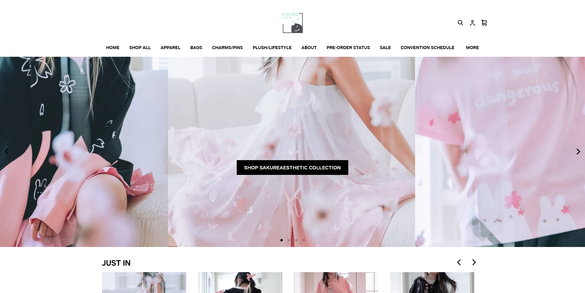

## My First Year Coding

  

Here is an example of a website using a UI framework:

Here is an example of a website that doesn't use a UI framework:

## Bootstrap 5

Bootstrap 5 is a UI framework that is dedicated to web development. Bootstrap is the most popular HTML, CSS, and Javascript framework for creating responsive websites. Bootstrap 5 is the latest version released as of 2024. It gives a number of pre-built components that optimize communication with users through navigation menus and page controls. The main structure consists of two basic directories, which are CSS and JS. CSS contains all the documents that are needed to style the page elements. While JS is the back end of the file that is responsible for the execution and requires interactive manipulation.

Here are some features that highlight Bootstrap 5:

1) **Component Library**: The pre-built components that offer a series of elements to improve communication with the user and optimize interaction. All form elements have a consistent look that is supported in all OS and browsers.
     
2) **Navigation Bar**: One of the most important components of Bootstrap 5, as it gives the possibility to build a more responsive navigation system. Enabling configuration of the menu in different ways, such as selecting between side or top positioning and defining the way users want.
   
3) **Responsive Designs**: Bootstrap is popular for its responsive websites! The framework works with the use of the class container, and the styling of the element div to guarantee the responsive design. It gives a default responsive font size, allowing to scale the text responsively in all viewports and devices. The responsive design allows developers to adjust the dimensions of a page according to the needs of the user and in general.
   
4) **Carousel**: Allows developers to display images in a responsive way. In other words, they can add different effects and transitions to move from one photo to another. By adding back and forward buttons, it makes the process much easier and more dynamic.

5) **Alerts**: Users can be alerted of something very specific by the developers that pop up on the website. For example, to pay attention to a new offer and a limited sale. Bootstrap allows developers to configure the alert however they want, such as changing the size and color to appeal to their users.
   
## My Personal Experience with Bootstrap 5

As I don't have much experience with designing websites using HTML and CSS. In the week that I started learning both basic HTML and CSS as well as Bootstrap 5, I found some benefits and difficulties. Starting with the difficulties, since I started learning UI designing with basic HTML and CSS, I became very comfortable with it. The transition over to Bootstrap 5 initially was a little difficult as I had to learn different components for the same application. However, I quickly learned how fast it was to build a website using Bootstrap. In Bootstrap, the first thing I learned was about the navigation bar, which at first I thought was more tedious since I felt like I had to write more code in the JS factor but I soon realized the benefit as the framework came with pre-built components. For example, the class container already contains padding and aligns my content. The biggest difference I noticed was that I didn't have to use my CSS too often to control the parameters, as Bootstrap already comes with a component library with certain parameters I can implement. Overall, I think if I continued using Bootstrap, it would definitely be more time-efficient than just using basic HTML and CSS.
