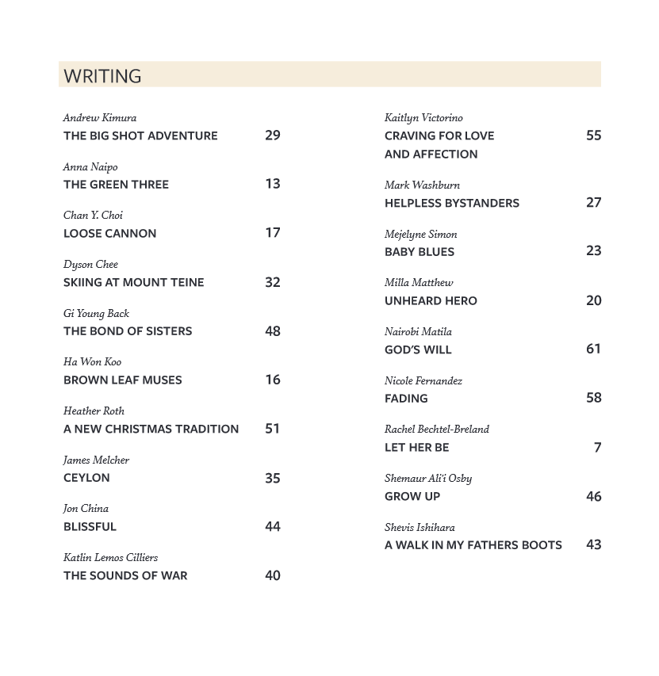

## The Bond of Sisters

“Of course,” I reply, a tender warmth
blossoming in my chest. “That’s what
sisters are for.”

The Bond of Sisters is a story about two sisters, who in the beginning had a very broken relationship but learn to appreciate and understand each other at the end. 

Growing up, I enjoyed reading all the time. Whether the book was about fiction, mystery, fantasy, short stories, or novels, I loved it all. Even now, I enjoy a good book every now and then but of course, I don't have the same time to leisurely read often. I think reading has definitely helped me write short stories. Although when I wrote The Bond of Sisters, I personally don't have a sister but you don't always have to relate the stories back to you. I love that about reading and writing, the creative freedom of being able to choose what path you want to take.

I submitted a short story I wrote for Eng 273 to Kapiolani Community College's Le'ahi: Creative Arts Journal. I was ecstatic to be chosen as one of authors in their journal. Before this journey, I have never imagined I would be chosen since I never had any other stories published or even attempted to. As I wrote this story, I never had the intention to release it publicly but after it got published, I was very greatful for the experience. It really taught me, things will never happen until you make the first move. With that mindset, I hope to continue moving forward and not being afraid of what comes next.

You can find my short story on page 48!

Source: <a href="https://dspace.lib.hawaii.edu/server/api/core/bitstreams/e39c518f-f875-467d-8f97-4516baaeb09c/content"><i class="large github icon "></i>Spring 2018 Le'ahi Creative Arts Journal</a>
