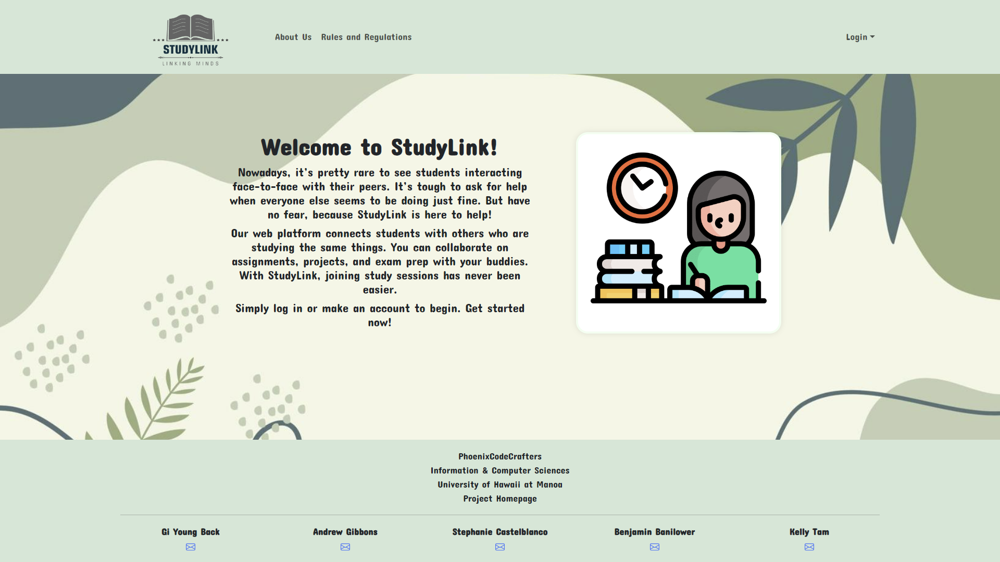
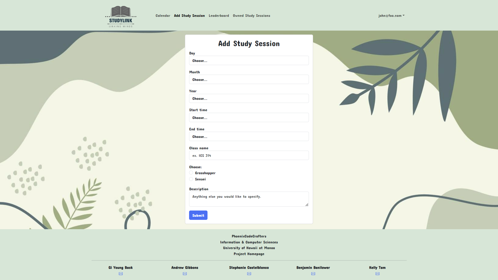
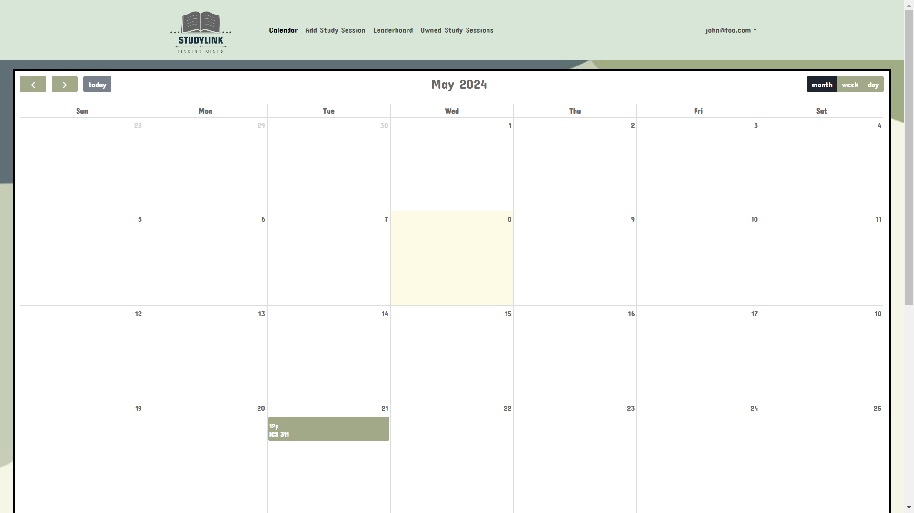

## Overview

StudyLink is a web application for UHM ICS students to self-organize face-to-face groups around a course and/or specific homework or project topic. For students who are afraid tor each out for help now have an easier time by making sessions online available for other students and teachers to reach out!

To leverage StudyLink's functionalities, students must first log in and establish their profile. This profile serves as a means for other students to identify and connect with them, comprising a concise self-description and a profile picture. Subsequently, upon account creation, students gain access to a comprehensive array of features, including a calendar, the ability to schedule study sessions, and a dashboard showcasing their session history.

As StudyLink primarily caters to student needs, an engaging gamification system has been integrated into the platform. Users assume roles either as "grasshoppers" (students) or "senseis" (mentors). By actively participating in study sessions in either capacity, students accumulate points, fostering a competitive spirit. The top three performers in the leaderboard are duly recognized and rewarded for their academic engagement.

Through its approach, StudyLink not only facilitates academic collaboration but also incentivizes active involvement, thereby enhancing the overall learning experience for UHM ICS students.

## My Contributions 
 
As a member of the development team, my contributions to StudyLink were in making the landing page, add study session page, and helping with the calendar page, with a focus on enhancing user experience and functionality. Firstly, I took the responsibility in designing and developing the application's landing page. This pivotal component serves as the gateway for users, providing an intuitive introduction to StudyLink's features and benefits. With attention to the visuals and user-centric design principles, I tried to make a landing page that not only captivates users but also conveys the essence of StudyLink's mission - fostering collaborative learning within the ICS community.

Additionally, I played a pivotal role in refining two core features of the application: the calendar and the add study session page. The calendar serves as a central hub for scheduling and coordinating study sessions, allowing users to seamlessly align their study efforts with peers. Leveraging my expertise in software engineering and user interface design, I implemented intuitive calendar functionalities that empower users to effortlessly manage their study schedules and engage with fellow students. As the add study session page works directly with the calendar, I had to ensure seamless integration between the two.

## What I Learned

Throughout my journey with StudyLink, I gained invaluable insights into the complexities of software development and user-centered design. Collaborating within my team taught me the importance of effective communication, adaptability, and collaboration in delivering impactful solutions. By navigating through the new functionalities of Bootstrap Meteor, I further developed my problem-solving skills and cultivated a deeper understanding of the different plug-ins.

In conclusion, StudyLink stands as a testament to our collective commitment to revolutionizing collaborative learning within the UHM ICS community. StudyLink empowers students to fight through solitary studying and embrace the transformative potential of group study sessions.

## To Visit Our Page

If you would like to check out our project, feel free to visit our <a href="https://phoenix-codecrafters.github.io/"><i class="large github icon "></i>project home page</a>
