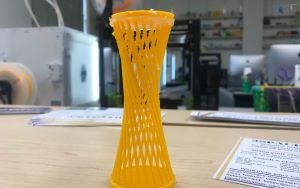

## Conics

"What are conics? Conic is a curve obtained from a right conical surface within a plane. The conic consist of the focus, directrix, and the eccentricity. In other words, the fixed ratio between the distance of one point from another that constructs a curve. Traditionally, there are three different type of conics, the ellipse, hyperbola, and parabola. Our project focused on hyperbolas.

When I was in high school, my teammates and I did a project mathematically proving the relationship between conic and real life building structures. We do a lot of mathemathics growing up but we don't always get to apply it to real life. In this project, we built the Kobe tower (out of fizzy sticks), which is made up of hyperbolas to prove the importance of using mathematics in real life applications. The Kobe Port Tower is a hyperboloid structure that's shape is generated by rotating a hyperbola around its conjugate axis. We first wrote a research paper to understand the nature of conics and our test subject, the Kobe Tower. Then, we mathematically proved the hyperbolic shape using the formula for hyperbolas. Finally, we build the Kobe Tower using fizzy sticks to show the hyperboloid shape.

We learned that it takes a lot of teamwork to build projects together. Everybody had their own responsibility, whether it was getting the right angle on the fizzy sticks to making the base of the conic. After we finished the project, we appreciated the arhitects and engineers even more on building the actual Kobe Tower. It was harder than we expected but a lot of fun!

Source: <a href="https://docs.google.com/document/d/1c4nHBqdlAXzerCSVoWg1m9Cb3nZkQbHyu-uIhG1MfQA/edit?usp=sharing"><i class="large github icon "></i>ConicsResearchProject</a>
